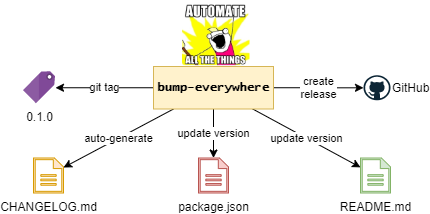
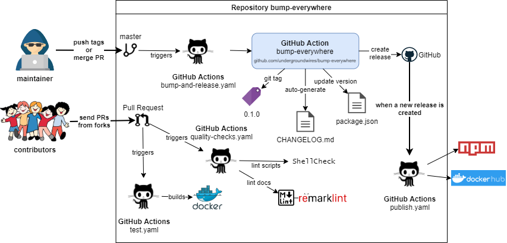

# bump-everywhere

> 🚀 Automate versioning, changelog creation, README updates and GitHub releases using GitHub Actions,npm, docker or bash.

[](https://github.com/undergroundwires/bump-everywhere/issues)
[](./.github/workflows/quality-checks.yaml)
[](./.github/workflows/bump-and-release.yaml)
[](./.github/workflows/publish.yaml)
[](./.github/workflows/test.yaml)
[](./scripts)
[](https://hub.docker.com/r/undergroundwires/bump-everywhere)
[](https://github.com/undergroundwires/bump-everywhere)
<!-- [](https://www.npmjs.com/package/bump-everywhere) -->



## Features

Allows you to automatically:

- Bump your sematic git tag by increasing the patch version
- Create & commit a changelog file
- If `npm` project then bump `package.json` version and commit
- Check `README.md` file, if it has references to older version, update with never version.
- Create a release on GitHub with auto-generated release notes

It supports safe re-runs, it means that if you can run it for an already bumped or tagged repository, it'll not increase the version as everything is still up-to-date. It protects against recursive runs.

## Usage

### Option 1. Use GitHub actions

```yaml
- uses: undergroundwires/bump-everywhere@master
  with:
    # Repository name with owner to bump & release. For example, undergroundwires/bump-everywhere
    # (Optional) Default: ${{ github.repository  }}
    repository: ''

    # Name of the user who will do the bump commit
    # (Optional) Default: ${{ github.actor }}
    user: ''

    # Commit message that will be used in the bump commit
    # (Optional) Default: ⬆️ bump everywhere to {{version}}
    commit-message: ''

    # Personal access token (PAT) used to clone & push to the repository.
    # If you use default, it'll not trigger other actions, but your own PAT then it triggers new actions
    # (Optional) Default: ${{ github.token }}
    git-token: ''

    # The type of the GitHub release
    # Options: 'release' | 'prerelease' | 'draft' | 'none' (does not release)
    # (Optional) Default: 'release'
    release-type: ''

    # Personal access token (PAT) used to release to GitHub.
    # Used only if release-type is not "none"
    # If you use default, it'll not trigger other actions, but your own PAT then it triggers new actions
    # (Optional) Default: ${{ github.token }}
    release-token: ''
```

[↑](#bump-everywhere)

### Option 2. Use Docker

- To get the image you can either:
  - Pull from docker hub using `docker pull undergroundwires/bump-everywhere:latest`
  - Or build image yourself using `docker build . --tag undergroundwires/bump-everywhere:latest`
- Run with arguments:

  ```sh
    docker run undergroundwires/bump-everywhere \
      --repository "undergroundwires/privacy.sexy" \
      --user "bot-user" \
      --git-token "GitHub PAT for pushes" \
      --relase-type "prerelase" \
      --release-token "GitHub PAT for releases" \
      --commit-message "⬆️ bump to {{version}}"
  ```

[↑](#bump-everywhere)

### Option 3. Use `npm`

1. (Optionally) install globally: `npm install -g bump-everywhere`
   - or locally: `npm install bump-every-where --save-dev`
2. Run `npx bump-everywhere <parameters...>`
   - See [docker example](#option-2-use-docker) for parameter usage

[↑](#bump-everywhere)

### Option 4. Use scripts

1. Ensure `bash` (4 or newer), `git`, `curl`, `jq` exists in your environment
   - run e.g. `apk add bash git curl jq`
2. Clone this repository: `git clone https://github.com/undergroundwires/bump-everywhere`
   - or optionally add this repository as git submodule: `git submodule add https://github.com/undergroundwires/bump-everywhere`
3. Call the script: `bash "scripts/bump-everywhere.sh" <parameters>`
   - See [docker example](#option-2-use-docker) for parameter usage

[↑](#bump-everywhere)

## Updating minor & major versions

- You manually tag your last commit to update major & minor versions.
- E.g.
  - `git commit -m "bumped version to 1.2.0" --allow-empty`
  - `git tag 1.2.0`
  - `git push && git push origin 1.2.0`

[↑](#bump-everywhere)

## All scripts

You can also use following scripts individually (check script files for usage, prerequisites & dependencies):

- **[bump-and-tag-version.sh](./scripts/bump-and-tag-version.sh)**: Automate versioning.
- **[create-github-release.sh](./scripts/create-github-release.sh)**: Automate creating GitHub releases
- **[print-changelog.sh](./scripts/print-changelog.sh)**: Automate creation of changelogs, e.g. `CHANGELOG.md`.
- **[configure-github-repo.sh](./scripts/configure-github-repo.sh)**: Set-up CI/CD user for current repository.
- **[log-commits.sh](./scripts/shared/log-commits.sh)**: Filters & logs commits as bullet points in markdown form.
- **[bump-npm-version.sh](./scripts/bump-npm-version.sh)**: Updates `packages.json` to match the latest version.
- **[bump-readme-versions.sh](./scripts/bump-readme-versions.sh)**: Updates old references to `README.md` to the latest version.

[↑](#bump-everywhere)

## Some example usages

- [bump-everywhere](https://github.com/undergroundwires/bump-everywhere#gitops): Repository itself is automatically versioned & released using its own action
- [privacy.sexy](https://github.com/undergroundwires/privacy.sexy#gitops-cicd-to-aws)
- [safe-email](https://github.com/undergroundwires/safe-email#gitops)
- [ez-consent](https://github.com/undergroundwires/ez-consent#gitops)
- [aws-static-site-with-cd](https://github.com/undergroundwires/aws-static-site-with-cd)

## GitOps

CI/CD is fully automated for this repo using different GIT events & GitHub actions.

[](./.github/workflows)

## Support

- Give it a star ⭐
- Feel free to use the badge in the `README.md` of repository where you use bump-everywhere:
  - (it'll look like: [](https://github.com/undergroundwires/bump-everywhere))

```markdown
[](https://github.com/undergroundwires/bump-everywhere)
```

[↑](#bump-everywhere)
